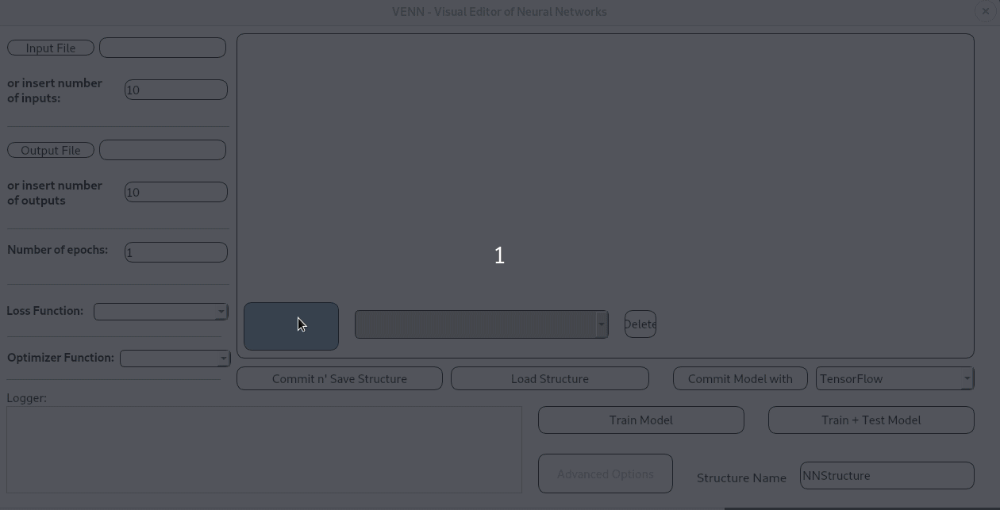
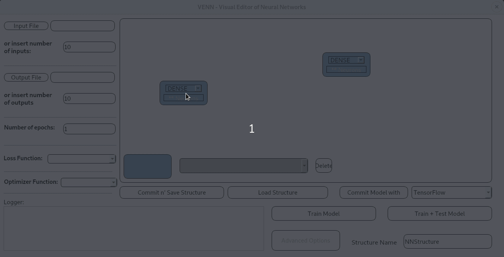

# Other Sections

* ### <a href="../README.md#install">How to Install</a>
* ### <a href="../README.md#ossupport">Supported Operating Systems</a>
* ### <a href="../README.md#documentation">Documentation</a>
* ### <a href="../README.md#funcs">Functionalities</a>
* ### <a href="rules.md#rules">Rules and Usage</a>
* ### <a href="frameworks.md#frames">Frameworks Supported</a>
* ### <a href="neuralnetwork.md#whatis">What is a Neural Network?</a>

###  How to use
 

  
Let's take a look at the gui of the tool, as shown in the above picture: we can tell right away that there are essentially four distinct areas.

In the upper left corner we can see the an area where we can specify various options relative to the run/test mode: the input and output data we want to train the model with, the epochs number for the training session and the loss and optimizer functions we want to use. The only thing which needs to be modified right away is the number of values for each input and each output -aka their dimensionalities. We are coming back to this later on.

In the lower left corner we can see the logger, which will show us every possible problem or useful piece of information regarding the completion of a task - such as the creation of a model, or the export of the model into a framework, or so on.

In the lower right corner we can find the various options: saving and loading a structure with a personalized name - specified in the "structure name" label - or with the standard NNStructure name, export the model into one of the available frameworks and run and/or test the exported model with the specified framework. Remember that, if a model is successfully exported and/or trained, than it is automatically saved for rapid exportation and deployment.

Finally we can find in the upper right corner the main window where we are actually going to graphically create our network.

####  Drag n' Drop

 

  

As you can see from the gif above, in the upper right corner we have an empty space where we can easily drag and drop blocks. We right-click and drag the empty template block in the lower left corner of this space, dropping it wherever we feel like. After dropping it, a new block is created, which let's us choose its behavior. In the next section we will define the supported block types.

Later on we are going to discuss this differentiation.

Right-clicking an existing block we can drag n' drop as many times as we want, allowing us the modify and replace the blocks as we design our network.

Left-clicking the block it allows us to select it. One a block is selected it changes color to a light gray. Right clicking anywhere in the empty space allow us to unselect it. If we select another block after selecting the first one, it creates automatically a blank arch between them. Selecting the arch let's us change its attribute by selecting the wanted activation function from the drop down box placed on the right of the template block, as shown in the below gif.

 

  

We can decide which activation function the selected arrow has to have among the  currently available, which are going to be listed later on.

Holding right-click and moving the mouse across this space allows us to select multiple objects which can be deleted pressing the delete button.

Once you complete your model, being careful to follow the <a href="rules.md">design rules</a>, we can than commit our structure, which will be saved in a file with extension .dr. This structure can be later on loaded graphically and used normally.

After saving and loading the structure, we are interested in exporting this model with one of the available frameworks: TensorFlow, Keras or Pytorch. It is extremely easy to do so: if you are sure that the design rules are followed, then you can choose the framework you want via the combobox (Note: the frameworks supported need to be installed on your system for actually being available). Once you chose the framework, you just push the "commit model with" button for creating the empty structure and, if the input and output data files are provided, you can also perform the training and even the testing by pushing "train model" or "train + test model".
 Remember: to train and test the model with any framework, you have to provide a loss function and an optimizer function. In the following sections, the available functions will be presented..

#### Blocks

As anticipated earlier, a variety of block types are supported:

* Input
* Output
* Dense - or fully connected -
* Pooling
* Convolution
* Sum
* Multiplication
* Subtraction
* Dropout
* Blank

Moreover, other types of functionalities are supported, such as ***

#### Activation Functions

The following activation functions are generally available, even if some of them are available in one framework and some in another one. In the "Frameworks Supported" section the specific division will be offered.

*  : no activation function
* Linear
* Rectified Linear - or ReLu -
* Hyperbolic Tangent - or Tanh -
* Hard Hyperbolic Tangent - or HardTanh -
* Exponential Linear - or Elu -
* Sigmoid
* Hard Sigmoid
* Softmax
* Softplus
* Log Softmax

#### Loss Functions

The following loss functions are generally available, even if some of them are available in one framework and some in another one. In the "Frameworks Supported" section the specific division will be offered.

* Mean Absolute Error - or MAE -
* Mean Absolute Percentage Error -or MAPE -
* Mean Squared Error - or MSE -
* Mean Squared Logarithmic Error - or MSLE -
* Binary Cross Entropy - or BCE -
* Soft Margin Loss - or SML -
* Log-Likelihood
* Negative Log-Likelihood
* Hinge
* Huber
* Logaritmic Cosine - or LogCosh -
* Poisson
* Poisson Negative Log-Likelihood
* Categorical Cross Entropy
* Sparse Categorical Cross Entropy
* Kullback-Leibler - or KLDivergence -
* Cosine Similarity

#### Optimization Functions

The following optimization functions are generally available, even if some of them are available in one framework and some in another one. In the "Frameworks Supported" section the specific division will be offered.

* Adam
* Adadelta
* Adagrad
* Adamax
* Nadam
* RMSprop
* Ftrl
* SDG
