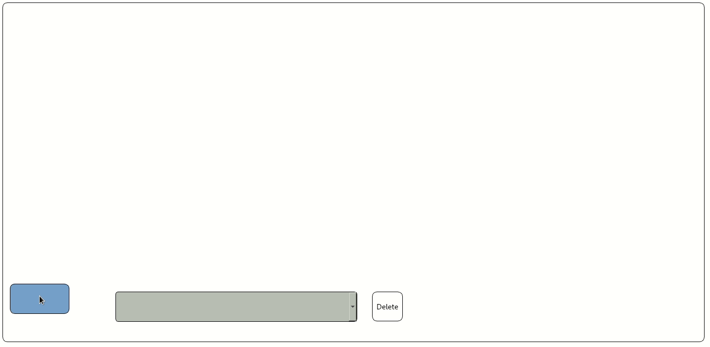

# Other Sections

* ### <a href="../README.md#install">How to Install</a>
* ### <a href="../README.md#ossupport">Supported Operating Systems</a>
* ### <a href="../README.md#documentation">Documentation</a>
* ### <a href="../README.md#funcs">Functionalities</a>
* ### <a href="HOWTO.md#howto">How to Use</a>
* ### <a href="frameworks.md#frame">Exporting Structures</a>
* ### <a href="neuralnetwork.md#whatis"> What is a Neural Network?</a>

### Rules and Usage

Here we discuss the rules and restriction for the design of the model.

#### Some Clarifications

Except when the structure has a convolution or recurrent node, the input and output data are flatten, meaning that whichever dimension each element had previously, before feeding it to the model it is flatten into a row vector.

Every "normal" block can receive in input max one arch and output as many as you like. The input block doesn't accept input arches (because its data are taken from the input(s) file(s)). The output block doesn't accept output arches. The "special" blocks - aka SUM, SUB and MULT blocks - can accept max 2 arches as input and as many as you like output arches.

The arches are straight arrows, meaning that if you want to create a multi branches structure or similar and you want to connect two blocks with a curve, you can't. However you can use a BLANK block, which is the removed with its following arch during the preparation of the structure for exporting it, to do so.

 

 

When performing a multiplication, the first node's dimensions are inverted, meaning that from [1]x[k] it becomes [k]x[1]. Then is multiplied to the second node, of dimensions [1]x[n]. The result is going to be [k]x[n]. Finally a flattening operation is performed on the result, giving back a vector of dimensions [1]x[k*n].

#### Structure rules

When creating the graphical block diagram of the structure, some rules and precautions need to be followed. These "rules" are discussed in the following paragraphs.

Every structure has to have one (for now. In the future multiple inputs support will be added) input block and one output block. In fact a sanity check to find the correct flow of the diagram is performed. The structure will not be saved if there aren't at least one input and one output. If the input and output blocks are present but not connected, the structure is saved but it won't be exported into one of the available frameworks.

When inserting a "SUM" block, the two previous blocks need to have the same number of neurons.
