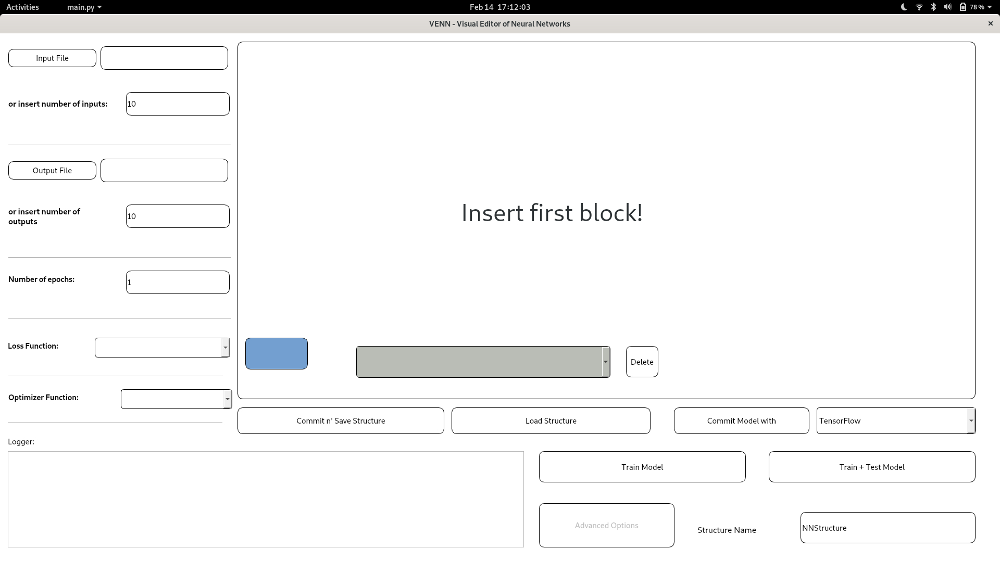

This program is a Visual Editor of Neural Network.

## Sections

* ### [VENN](#VENN)
    * #### [How to Install](#install)
    * #### [Supported Operating Systems](#ossupport)
    * #### [Documentation](#documentation)
    * #### [Functionalities](#funcs)
    * #### <a href="Manual/HOWTO.md#howto">How to use</a>
      * ##### <a href="Manual/HOWTO.md#dragdrop">Drag n' Drop</a>
      * ##### <a href="Manual/HOWTO.md#blocks">Blocks</a>
      * ##### <a href="Manual/HOWTO.md#archs">Activation Functions</a>
      * ##### <a href="Manual/HOWTO.md#loss">Loss Functions</a>
      * ##### <a href="Manual/HOWTO.md#optim">Optimization Functions</a>
    * #### <a href="Manual/rules.md#rules">Rules and Usage</a>
      * ##### <a href="Manual/rules.md/structClar">Some Clarifications</a>
      * ##### <a href="Manual/rules.md/structRules">Structure Rules</a>
    * #### [TODO](#todo)
* ### <a href="Manual/frameworks.md#frames">Exporting Structures</a>
    * #### <a href="Manual/frameworks.md#framehowto">How does it work?</a>
    * #### <a href="Manual/frameworks.md#otherframes">Adding new Frameworks</a>
    * #### <a href="Manual/framework.md#framesupp">Frameworks Supported</a>
      * ##### <a href="Manual/frameworks.md#tensor">TensorFlow</a>
      * ##### <a href="Manual/frameworks.md#keras">Keras</a>
      * ##### <a href="Manual/frameworks.md#pytorch">Pytorch</a>
* ### <a href="Manual/neuralnetwork.md#whatis">What is a Neural Network?</a>
    * #### <a href="Manual/neuralnetwork.md#feedfor">Feed Forward</a>
    * #### <a href="Manual/neuralnetwork.md#backprop">Back Propagation</a>
    * #### <a href="Manual/neuralnetwork.md#cnn">Convolution Neural Network</a>

##  VENN

 

  

This tool is designed and built to offer a graphical editor for the construction and manipulation of neural networks.

So far, neural networks had to be built by coders through more-or-less complex programs. Even if various open-source frameworks greatly helped the grievous task of building these models, someone new to programming should initially start by learning how to code, before even considering  the actual process of creating a neural network.

Another somehow annoying problem was that every framework has its own standard file structure were a neural network model is temporarily saved making it impossible to directly convert a network's model from one framework to another.

### How to Install

Visual Editor tool for Neural Network development training and deployment

To use this project you have to install:

- (Mandatory) PyQt5:

<b>pip3 install PyQt5 --user</b>
  
- (Optional) Tensorflow:

<b>pip3 install tensorflow --user</b>
  
- (Optional) Pytorch:

<b>pip3 install torch torchvision --user</b>
  
- (Optional) Keras:

<b>pip3 install keras --user</b>
  
- (Optional) Documentation:

<b>pip3 install pdoc --user</b>
  

<b>pip3 install torchsummary --user</b>
  
Or:

- <b>git clone https://www.github.com/drasgo/VENN</b>
- <b>sudo python3 setup.py install</b>

To execute the tool you have to run the file main.py using python3:

<b>python3 main.py</b>

 

<b>Note</b>: a possible error could be encountered while installing - or while running the program - regarding PyQt5: it might be necessary to install PyQt5 also through the terminal using the commands apt-get, dnf or others depending on your OS.

### Supported Operating Systems

Currently the - known - supported Operating Systems are Ubuntu and Fedora for lack of testers. However everyone is welcome to download and try to use this tool on your OS, so we can work on supporting yours OS in case it doesn't work.

However it should potentially work on every machine that supports at least Python3 and PyQt5.

###  Documentation

To automatically generate the documentation run on the terminal the following command:

<b>pdoc --html path/to/project/directory</b>

This will generate a folder called html with the documentation. Note: this can be done only if you already installed the pdoc package through pip3.

###  Functionalities

This tool let's you to build a blocks-arrows scheme of the neural network you want to design, giving you infinite possible combinations, which makes space for your creativity to think and create everything it wants.

This project removes a layer of complexity to the creation of a neural network: to only thing you have to do is just decide how the network has to be and just drag n' drop the blocks in place.

Every graphical model can be saved in a json structure which can be then moved and sent everywhere. After being saved, the structure can be easily loaded into the system just by pressing a button.

Furthermore, the designed model can be exported in various frameworks. So far the following frameworks are supported: Keras, Tensorflow, Pytorch and FastAI (still in implementation phase *** ). However many more frameworks can be easily supported, thanks to the wrapperTemplate class, which automatically performs bothersome tasks and gives you the prototype of functions which need to be implemented for the conversion of the graphical model into your framwork's. Once implemented these few functions, the system is ready to go, and you can start to graphically design your network and export it right away.

Another essential feature is that yo are able to design, create and export the system into your framework of choice and sequentially train and test it with input and output data saved on a file which you can freely add select from inside the program. Once the model is trained you can save it once again. A usable trained model ready for deployment.

Finally a great deal of importance was given to the freedom of choice of the user. A vast number of activation functions, loss functions, optimization functions and layer types are offered, allowing you to use functions which may be available in a framework but not in another. This grants you the possibility to create every type of neural network, from simple to complex one, without having to go through the same annoying and difficult process of coding the structure, modify it, understanding of to use it, etc., again and again and again.

### TODO
- Add multiple inputs support
- add recursive support
- add convolution support
- add dropout support
- add pooling support
- add whatstis tip for every sensible label in gui
- general bugfix
- comments
- Double check for cost/loss/activation/optimization functions for all frameworks
